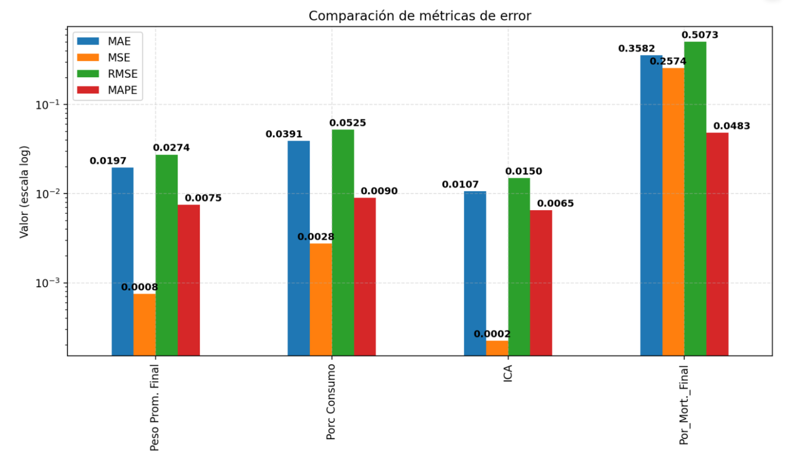
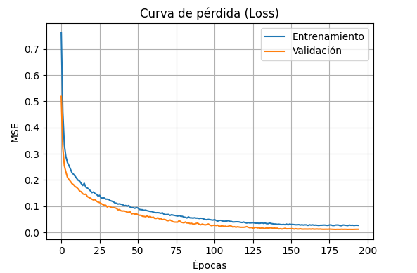

# INFORME TÉCNICO  
## IMPLEMENTACIÓN Y VALIDACIÓN DE UN MODELO DE RED NEURONAL PROFUNDA (MLP) PARA LA PREDICCIÓN INTEGRAL DE INDICADORES CLAVE DE RENDIMIENTO (KPI) AVÍCOLAS

### 1. Contexto y relevancia
La industria avícola enfrenta el reto de optimizar los recursos, anticipar riesgos y mejorar el rendimiento de los lotes de engorde. Tradicionalmente, la estimación de indicadores como el peso promedio final, porcentaje de mortalidad, porcentaje de consumo y el índice de conversión alimenticia (ICA) se basa en procedimientos manuales, reactivos y dependientes de la experiencia operativa.  
El análisis de integridad intestinal mediante necropsias periódicas —una fuente de señales tempranas— no siempre se traduce en predicción proactiva, lo que puede provocar intervenciones tardías, uso ineficiente de recursos y pérdidas de rendimiento.  
Por ello, resulta estratégico contar con un sistema predictivo que transforme esos datos de monitoreo en conocimiento anticipado para la toma de decisiones zootécnicas.
En este contexto, la elección de las variables de entrada no fue arbitraria, sino fundamentada en criterios biológicos y productivos. Cada característica representa un aspecto clave del estado sanitario, crecimiento y manejo del lote, lo que permite que el modelo aprenda relaciones fisiológicas reales, no solo patrones estadísticos. Esto refuerza la capacidad del sistema para anticipar riesgos productivos con mayor realismo.

### 2. Objetivo del sistema propuesto
Desarrollar e implementar un sistema basado en un modelo de red neuronal profunda tipo perceptrón multicapa (MLP) que permita anticipar los KPI clave de lotes de pollos de engorde (Peso promedio final, % mortalidad final, % consumo, ICA) en función de datos de entrada que incluyen resultados de necropsias (edad HTS, edad de granja), mortalidad semanales tempranas, peso promedio precoz, población inicial y área del galpón.  
El propósito es ofrecer una herramienta de apoyo a la gestión operativa y estratégica de la granja.
El modelo integra información procedente de necropsias avícolas —fuente directa del estado fisiológico de las aves— junto con registros productivos semanales. Esta combinación permite conectar la salud del lote con sus resultados finales (peso, consumo, ICA y mortalidad), brindando un enfoque holístico y predictivo del rendimiento zootécnico.

### 3. Alcance
- **Entrada de datos:** variables iniciales del lote (por ejemplo, mortalidad en semanas 4‑6, peso promedio semanas 4‑5, población inicial, edad HTS, edad granja, categórico área).  
- **Salida:** predicciones multisalida del modelo MLP de los indicadores: Peso Promedio Final, %Consumo, ICA, %Mortalidad Final.  
- **Interfaz:** aplicación Streamlit para ingreso manual o por archivo (.csv/.xlsx) y descarga de resultados.  
- **Preprocesamiento:** codificación de variables categóricas, escaladores de entrada y salida.  
- **Evaluación:** métricas de desempeño, análisis de errores e interpretación operativa.
  
#### Fundamentación de las variables de entrada

Las nueve variables seleccionadas (porc_mort_sem4, porc_mort_sem5, porc_mort_sem6, peso_sem4, peso_sem5, población_inicial, edad_HTS, edad_granja y área) fueron definidas a partir de su relevancia biológica, sanitaria y operativa.

* **Mortalidad semanal (4–6):** refleja la progresión sanitaria y el impacto de enfermedades.

* **Pesos intermedios (sem4–sem5):** indican la tendencia productiva y permiten anticipar desvíos en crecimiento.

* **Población inicial:** contextualiza el manejo y la densidad.

* **Edad HTS / Edad granja:** calibran el punto temporal del ciclo productivo.

* **Área:** variable diagnóstica derivada de necropsias (digestiva, respiratoria, metabólica, etc.), clave para aprender relaciones entre patologías y desempeño.

### 4. Arquitectura técnica
El sistema adopta la siguiente arquitectura:

1. **Preprocesamiento:** limpieza y escalado de variables.  
2. **Modelo MLP multisalida:** red neuronal construida en Keras/TensorFlow con 9 variables de entrada y 4 salidas.  
3. **Persistencia:** almacenamiento del modelo en formato `.keras`.  
4. **Interfaz:** aplicación Streamlit (`pipeline_evaluacion_streamlit.py` / `app2.py`) para predicción y descarga.  
5. **Modularidad:** carpetas organizadas (`modelos/`, `utils/`, `graficos/`, etc.) que facilitan mantenimiento y expansión.
#### Decisión de ingeniería: división 80/20 para creacion de modelo

El conjunto de datos se dividió en un 80 % para entrenamiento y un 20 % para prueba, siguiendo el principio de equilibrio entre sesgo y varianza.
Esta decisión de ingeniería busca asegurar que el modelo:

Disponga de suficientes datos para aprender patrones complejos sin sobreajuste (sesgo bajo).

Reserve una proporción adecuada para evaluar la generalización sobre casos no vistos (varianza controlada).

Desde un punto de vista estadístico, esta proporción es la más utilizada en datasets medianos-grandes y en modelos de alta capacidad, como las redes neuronales MLP.
En entornos industriales, el 80/20 representa el balance óptimo entre capacidad de aprendizaje, evaluación fiable y eficiencia computacional.

En resumen, esta división garantiza que el sistema no solo aprenda de los lotes históricos, sino que también generalice su conocimiento para anticipar resultados de nuevos lotes con diferentes condiciones productivas y sanitarias.

### 5. Validación y métricas
Para la comunicación con áreas de negocio se recomiendan métricas como MAE, MAPE y R².  
Las gráficas complementarias pueden incluir:
- Curvas de aprendizaje  
- Dispersión predicción-real  
- Análisis de residuales  

Estos resultados deben interpretarse en términos de impacto: por ejemplo, una mejor predicción del peso final permite ajustar el plan de alimentación y mejorar el ICA.

#### 📊 Barras de Error: La Magnitud de la Precisión

Este gráfico compara las **magnitudes del error** de nuestro modelo para el **Lote Actual**, permitiéndonos ver rápidamente dónde somos más precisos.

##### ¿Cómo se Interpreta el Gráfico?

* **Eje Vertical (Valor - escala log):** Muestra el tamaño del error. Cuanto **más baja** es una barra, **mejor es la predicción**.
    * *Nota: El eje usa una escala especial (logarítmica) para poder mostrar errores muy grandes y muy pequeños en el mismo gráfico.*
* **Las Barras:** Representan cuatro tipos de error para cada variable (Peso, Consumo, ICA y Mortalidad).
    * **MAE (Azul):** Error absoluto promedio (en unidades de la variable).
    * **RMSE (Verde):** Similar al MAE, pero penaliza más los errores grandes (el mejor indicador del error general).
    * **MAPE (Rojo):** Error promedio expresado como **porcentaje** del valor real (la métrica más fácil de entender).
    * **MSE (Naranja):** Error cuadrático medio (base del RMSE, pero menos intuitivo).

##### 🔎 Conclusiones Críticas

El mensaje clave es que el error es **mínimo** en las métricas de eficiencia productiva:

1.  **ICA y Peso Prom. Final:** Estas variables tienen las barras de error más bajas en general, especialmente el **ICA**.
    * El **ICA** tiene un **MAPE de solo 0.0065** (o **0.65%**), y su MAE es de **0.0107** puntos. Esto confirma que la predicción del **costo de alimento es casi perfecta**.
    * El **Peso Prom. Final** tiene un **MAPE de 0.0075** (o **0.75%**), una precisión excelente.

2.  **Por_Mort._Final (Mortalidad):**
    * Esta variable presenta los errores absolutos más altos (**MAE de 0.3582** y **RMSE de 0.5073**). Esto es esperable porque la mortalidad es impredecible (eventos sanitarios, clima).
    * **Importante:** A pesar de los errores absolutos altos, su **MAPE es bajo (0.0483 o 4.83%)**, lo que significa que el error se mantiene bajo control en relación con la magnitud real de la mortalidad.

**En resumen:** Las métricas críticas de **eficiencia (ICA y Peso)** tienen errores prácticamente nulos, dándole la máxima confianza en la planificación del rendimiento y el costo. La **mortalidad**, aunque más variable, sigue siendo manejable y predecible en términos relativos, lo que es vital para la gestión de riesgos en la producción avícola. 

#### 📉 Explicación de la Curva de Pérdida (Loss)
    
    Esta gráfica es su **medidor de confianza** en la capacidad del modelo para predecir las cuatro métricas clave (Peso Final, Consumo, ICA, Mortalidad).
    
    * **¿Qué mide la Pérdida (Loss)?**
        * Mide el **Error Cuadrático Medio (MSE)**. Es el **error promedio** del modelo. Se usa porque cuantifica la distancia entre las predicciones del modelo y los valores reales observados. Un valor más bajo (cercano a cero) significa un modelo más preciso.
    
    * **Línea Azul (Entrenamiento):** Muestra el error con los **datos históricos ya conocidos**.
    * **Línea Naranja (Validación):** Muestra el error con los **datos que nunca ha visto**. Este es el error más importante, ya que indica la **confiabilidad** del modelo en lotes futuros.
    
    **📈 Diagnóstico de Calidad del Aprendizaje:**
    
    El modelo presenta un **aprendizaje óptimo y robusto**. El hecho de que las curvas de Entrenamiento (Azul) y Validación (Naranja) **coincidan tan de cerca** a lo largo de las 200 épocas significa que el modelo **no ha memorizado** datos viejos (no hay sobreajuste).
    
    **Conclusión:** Puede confiar en que las predicciones y las explicaciones de factores son **consistentes y válidas** para evaluar lotes nuevos, ya que el modelo aprendió las **reglas fundamentales** de su negocio avícola.

### 6. Beneficios para el negocio
- **Proactividad:** anticipación de mortalidad, consumo e ICA antes del cierre del lote.  
- **Optimización de recursos:** ajuste de insumos y reducción de pérdidas.  
- **Eficiencia operativa:** control más preciso y trazabilidad.  
- **Soporte a la toma de decisiones:** información cuantitativa para la dirección de la granja.

### 7. Limitaciones y consideraciones
- Datos de entrenamiento limitados a ciertas condiciones.  
- Dependencia de la calidad y consistencia de las necropsias.  
- Posible necesidad de reentrenamiento ante cambios genéticos o ambientales.  
- Requiere capacitación para interpretación adecuada por parte del equipo técnico.
- A pesar de las limitaciones, la estructura de variables elegida dota al modelo de una base robusta y fisiológicamente interpretable. Cada predictor aporta información complementaria que mejora la robustez ante escenarios variables, manteniendo la coherencia biológica del aprendizaje.

### 8. Recomendaciones de implementación
- **Programa piloto** para validar el modelo en condiciones reales.  
- **Monitorización continua** comparando predicciones vs resultados reales.  
- **Ampliar base de datos** con más lotes y condiciones.  
- **Integración operativa:** definir umbrales de alerta.  
- **Dashboard de seguimiento** con herramientas como Power BI.

### 9. Próximos pasos y evolución
- Incluir nuevas variables (ambiente, cama, agua).  
- Explorar arquitecturas más avanzadas (RNN, LSTM).  
- Incorporar interpretabilidad (SHAP, LIME).  
- Escalar el sistema a múltiples granjas y entornos web.

### 10. Conclusión final 

En síntesis, la arquitectura MLP y la selección de variables biológicas, sanitarias y de manejo convierten este modelo en una herramienta predictiva integral.
Su diseño responde a fundamentos estadísticos (división 80/20) y científicos (representación fisiológica del lote), lo que asegura un equilibrio entre precisión, interpretabilidad y aplicabilidad en la gestión avícola moderna.
---
**Autor:** Jose Longa  
**Área:** Desarrollo de Sistemas Inteligentes  
**Proyecto:** Predicción Integral de Indicadores Clave de Rendimiento Avícola mediante Deep Learning
