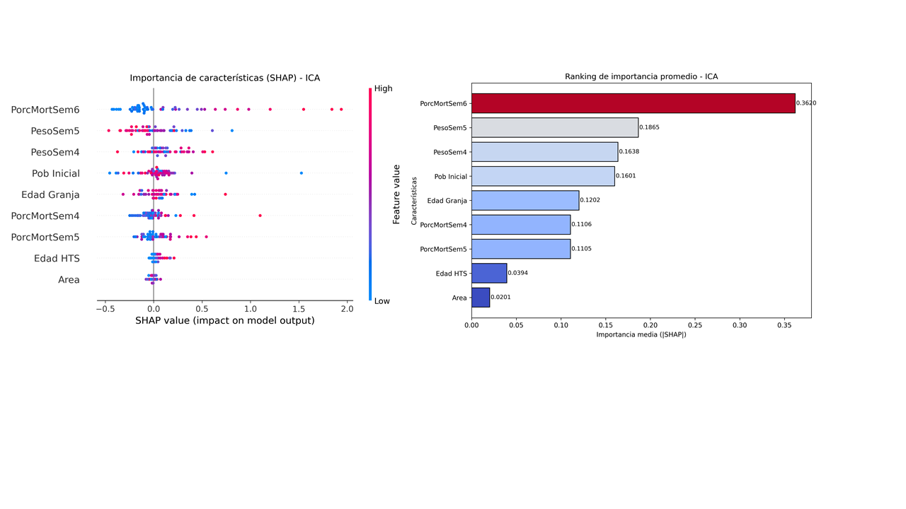
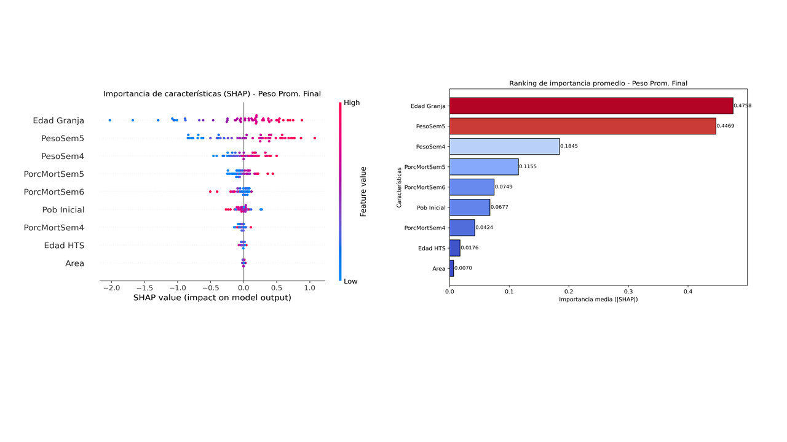
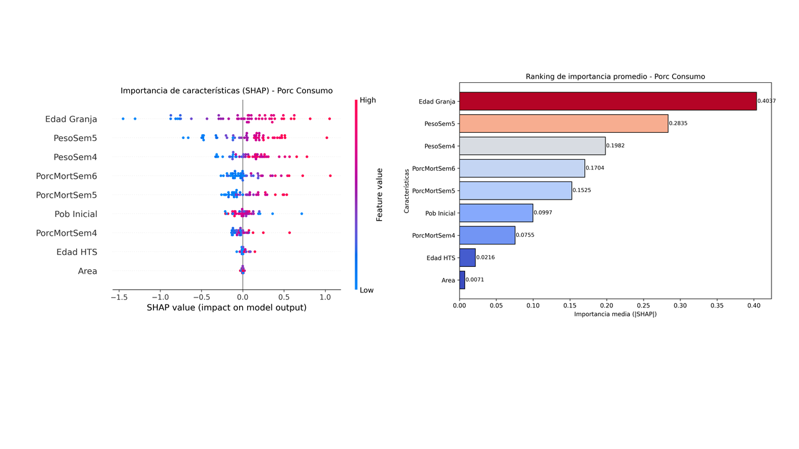
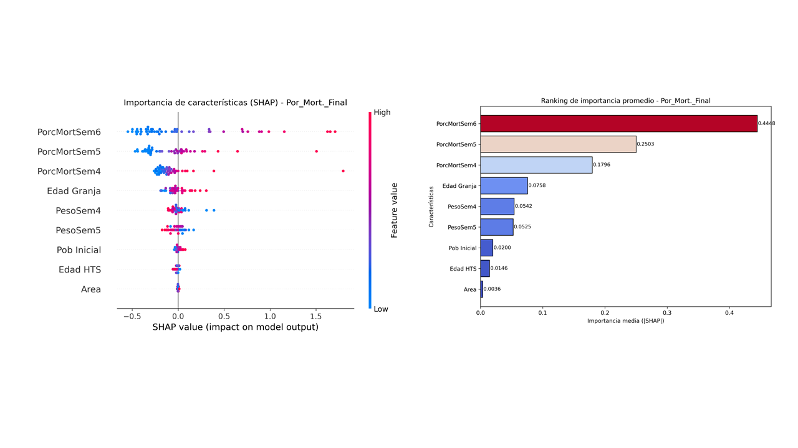

# INFORME TÉCNICO  
## IMPLEMENTACIÓN Y VALIDACIÓN DE UN MODELO DE RED NEURONAL PROFUNDA (MLP) PARA LA PREDICCIÓN INTEGRAL DE INDICADORES CLAVE DE RENDIMIENTO (KPI) AVÍCOLAS

### 1. Contexto y relevancia
La empresa **San Fernando S.A.**, líder en el sector avícola peruano, enfrenta el desafío constante de optimizar sus operaciones productivas y anticipar factores que impactan en el rendimiento de sus lotes de pollos de engorde.  
Tradicionalmente, la estimación de indicadores clave —como el **peso promedio final**, **porcentaje de mortalidad**, **porcentaje de consumo** e **índice de conversión alimenticia (ICA)**— depende de métodos manuales y de la experiencia operativa, lo que puede retrasar la toma de decisiones críticas.  
El presente proyecto propone la implementación de un sistema predictivo basado en **redes neuronales profundas (MLP)**, capaz de transformar los datos de necropsias y registros semanales en **conocimiento accionable**. Este enfoque busca anticipar los resultados productivos y promover una **gestión proactiva** orientada a la eficiencia zootécnica.  
El análisis de integridad intestinal mediante necropsias periódicas —una fuente de señales tempranas— no siempre se traduce en predicción proactiva, lo que puede provocar intervenciones tardías, uso ineficiente de recursos y pérdidas de rendimiento.  
Por ello, resulta estratégico contar con un sistema predictivo que transforme esos datos de monitoreo en conocimiento anticipado para la toma de decisiones zootécnicas.
En este contexto, la elección de las variables de entrada no fue arbitraria, sino fundamentada en criterios biológicos y productivos. Cada característica representa un aspecto clave del estado sanitario, crecimiento y manejo del lote, lo que permite que el modelo aprenda relaciones fisiológicas reales, no solo patrones estadísticos. Esto refuerza la capacidad del sistema para anticipar riesgos productivos con mayor realismo.

### 2. Objetivo del sistema propuesto
Desarrollar e implementar un **modelo de red neuronal multicapa (MLP)** que prediga los indicadores clave de rendimiento (KPI) de los lotes de pollos de engorde a partir de variables biológicas y productivas, integrando información proveniente de necropsias, mortalidad semanal, pesos intermedios, edad de granja y área de diagnóstico.  
El sistema está diseñado como una herramienta de apoyo para el **equipo técnico y gerencial de San Fernando S.A.**, contribuyendo a la toma de decisiones anticipadas sobre manejo, alimentación y control sanitario.  
El propósito es ofrecer una herramienta de apoyo a la gestión operativa y estratégica de la granja.
El modelo integra información procedente de necropsias avícolas —fuente directa del estado fisiológico de las aves— junto con registros productivos semanales. Esta combinación permite conectar la salud del lote con sus resultados finales (peso, consumo, ICA y mortalidad), brindando un enfoque holístico y predictivo del rendimiento zootécnico.

### 3. Alcance
- **Entrada de datos:** variables iniciales del lote (por ejemplo, mortalidad en semanas 4‑6, peso promedio semanas 4‑5, población inicial, edad HTS, edad granja, categórico área).  
- **Salida:** predicciones multisalida del modelo MLP de los indicadores: Peso Promedio Final, %Consumo, ICA, %Mortalidad Final.  
- **Interfaz:** aplicación Streamlit para ingreso manual o por archivo (.csv/.xlsx) y descarga de resultados.  
- **Preprocesamiento:** codificación de variables categóricas, escaladores de entrada y salida.  
- **Evaluación:** métricas de desempeño, análisis de errores e interpretación operativa.
  
#### Fundamentación de las variables de entrada

Las nueve variables seleccionadas (porc_mort_sem4, porc_mort_sem5, porc_mort_sem6, peso_sem4, peso_sem5, población_inicial, edad_HTS, edad_granja y área) fueron definidas a partir de su relevancia biológica, sanitaria y operativa.

* **Mortalidad semanal (4–6):** refleja la progresión sanitaria y el impacto de enfermedades.

* **Pesos intermedios (sem4–sem5):** indican la tendencia productiva y permiten anticipar desvíos en crecimiento.

* **Población inicial:** contextualiza el manejo y la densidad.

* **Edad HTS / Edad granja:** calibran el punto temporal del ciclo productivo.

* **Área:** variable diagnóstica derivada de necropsias (digestiva, respiratoria, metabólica, etc.), clave para aprender relaciones entre patologías y desempeño.

### 4. Arquitectura técnica
El sistema adopta la siguiente arquitectura:

1. **Preprocesamiento:** limpieza y escalado de variables.  
2. **Modelo MLP multisalida:** red neuronal construida en Keras/TensorFlow con 9 variables de entrada y 4 salidas.  
3. **Persistencia:** almacenamiento del modelo en formato `.keras`.  
4. **Interfaz:** aplicación Streamlit (`pipeline_evaluacion_streamlit.py` / `app2.py`) para predicción y descarga.  
5. **Modularidad:** carpetas organizadas (`modelos/`, `utils/`, `graficos/`, etc.) que facilitan mantenimiento y expansión.
#### Decisión de ingeniería: división 80/20 para creacion de modelo

El conjunto de datos se dividió en un 80 % para entrenamiento y un 20 % para prueba, siguiendo el principio de equilibrio entre sesgo y varianza.
Esta decisión de ingeniería busca asegurar que el modelo:

Disponga de suficientes datos para aprender patrones complejos sin sobreajuste (sesgo bajo).

Reserve una proporción adecuada para evaluar la generalización sobre casos no vistos (varianza controlada).

Desde un punto de vista estadístico, esta proporción es la más utilizada en datasets medianos-grandes y en modelos de alta capacidad, como las redes neuronales MLP.
En entornos industriales, el 80/20 representa el balance óptimo entre capacidad de aprendizaje, evaluación fiable y eficiencia computacional.

En resumen, esta división garantiza que el sistema no solo aprenda de los lotes históricos, sino que también generalice su conocimiento para anticipar resultados de nuevos lotes con diferentes condiciones productivas y sanitarias.

### 5. Validación y métricas
Para la comunicación con áreas de negocio se recomiendan métricas como MAE, MAPE y R².  
Las gráficas complementarias pueden incluir:
- Curvas de aprendizaje  
- Dispersión predicción-real  
- Análisis de residuales  

Estos resultados deben interpretarse en términos de impacto: por ejemplo, una mejor predicción del peso final permite ajustar el plan de alimentación y mejorar el ICA.

#### 📊 Barras de Error: La Magnitud de la Precisión

Este gráfico compara las **magnitudes del error** de nuestro modelo para el **Lote Actual**, permitiéndonos ver rápidamente dónde somos más precisos.

##### ¿Cómo se Interpreta el Gráfico?

* **Eje Vertical (Valor - escala log):** Muestra el tamaño del error. Cuanto **más baja** es una barra, **mejor es la predicción**.
    * *Nota: El eje usa una escala especial (logarítmica) para poder mostrar errores muy grandes y muy pequeños en el mismo gráfico.*
* **Las Barras:** Representan cuatro tipos de error para cada variable (Peso, Consumo, ICA y Mortalidad).
    * **MAE (Azul):** Error absoluto promedio (en unidades de la variable).
    * **RMSE (Verde):** Similar al MAE, pero penaliza más los errores grandes (el mejor indicador del error general).
    * **MAPE (Rojo):** Error promedio expresado como **porcentaje** del valor real (la métrica más fácil de entender).
    * **MSE (Naranja):** Error cuadrático medio (base del RMSE, pero menos intuitivo).

##### 🔎 Conclusiones Críticas

El mensaje clave es que el error es **mínimo** en las métricas de eficiencia productiva:

1.  **ICA y Peso Prom. Final:** Estas variables tienen las barras de error más bajas en general, especialmente el **ICA**.
    * El **ICA** tiene un **MAPE de solo 0.0065** (o **0.65%**), y su MAE es de **0.0107** puntos. Esto confirma que la predicción del **costo de alimento es casi perfecta**.
    * El **Peso Prom. Final** tiene un **MAPE de 0.0075** (o **0.75%**), una precisión excelente.

2.  **Por_Mort._Final (Mortalidad):**
    * Esta variable presenta los errores absolutos más altos (**MAE de 0.3582** y **RMSE de 0.5073**). Esto es esperable porque la mortalidad es impredecible (eventos sanitarios, clima).
    * **Importante:** A pesar de los errores absolutos altos, su **MAPE es bajo (0.0483 o 4.83%)**, lo que significa que el error se mantiene bajo control en relación con la magnitud real de la mortalidad.

**En resumen:** Las métricas críticas de **eficiencia (ICA y Peso)** tienen errores prácticamente nulos, dándole la máxima confianza en la planificación del rendimiento y el costo. La **mortalidad**, aunque más variable, sigue siendo manejable y predecible en términos relativos, lo que es vital para la gestión de riesgos en la producción avícola. 

#### 📉 Explicación de la Curva de Pérdida (Loss)
    
Esta gráfica es su **medidor de confianza** en la capacidad del modelo para predecir las cuatro métricas clave (Peso Final, Consumo, ICA, Mortalidad).
    
* **¿Qué mide la Pérdida (Loss)?**
        * Mide el **Error Cuadrático Medio (MSE)**. Es el **error promedio** del modelo. Se usa porque cuantifica la distancia entre las predicciones del modelo y los valores reales observados. Un valor más bajo (cercano a cero) significa un modelo más preciso.
    
* **Línea Azul (Entrenamiento):** Muestra el error con los **datos históricos ya conocidos**.
* **Línea Naranja (Validación):** Muestra el error con los **datos que nunca ha visto**. Este es el error más importante, ya que indica la **confiabilidad** del modelo en lotes futuros.
    
**📈 Diagnóstico de Calidad del Aprendizaje:**
    
El modelo presenta un **aprendizaje óptimo y robusto**. El hecho de que las curvas de Entrenamiento (Azul) y Validación (Naranja) **coincidan tan de cerca** a lo largo de las 200 épocas significa que el modelo **no ha memorizado** datos viejos (no hay sobreajuste).
    
**Conclusión:** Puede confiar en que las predicciones y las explicaciones de factores son **consistentes y válidas** para evaluar lotes nuevos, ya que el modelo aprendió las **reglas fundamentales** de su negocio avícola.

Este gráfico de Importancia de Características (SHAP) nos da la radiografía de nuestro modelo: nos dice por qué el modelo predice un ICA bajo o alto, mostrando la influencia real de cada factor en sus lotes.
Ranking de Influencia: El gráfico de barras resume cuáles son las variables más importantes para predecir el ICA, ordenadas de mayor a menor impacto:
1.	PorcMortSem6: ¡Es el factor #1! La mortalidad en la última semana tiene el mayor impacto en el ICA predicho. La IA confirma que el riesgo de las etapas finales es crucial para la eficiencia.
2.	PesoSem5: El peso de la semana 5 es el segundo factor más influyente. Muestra que el desempeño temprano es vital.
3.	PesoSem4: El peso a la semana 4 también tiene un impacto significativo.
4.	Pob Inicial: La cantidad de aves al inicio del lote sigue siendo un factor importante de la conversión.
Conclusión: El modelo ratifica el conocimiento del negocio: el control sanitario (mortalidad tardía) y el desempeño de crecimiento (Peso Semanal) son los factores que definen la eficiencia (ICA) en su operación.
Direccion de Influencia: Detalla cómo cada factor impacta el ICA predicho. Un punto se mueve hacia la derecha si aumenta el ICA (lo cual es malo) y a la izquierda si disminuye el ICA (lo cual es bueno):
1.	PorcMortSem6: Los puntos Rojos (alta mortalidad en la semana 6) se agrupan fuertemente a la derecha, y los Azules (baja mortalidad) se agrupan a la izquierda. Impacto: Es la peor amenaza para la eficiencia. La alta mortalidad al final del ciclo eleva el ICA.
2.	PesoSem5 / PesoSem4: Los puntos Rojos (alto peso) se agrupan a la izquierda (disminuyen el ICA), y los Azules (bajo peso) se agrupan a la derecha. Impacto: El buen rendimiento impulsa la eficiencia. Un mayor peso en las semanas 4 y 5 ayuda a reducir el ICA.
3.	Pob Inicial: Los puntos Rojos (alta población) tienden a ir ligeramente a la derecha (aumentan el ICA), y los Azules (baja población) a la izquierda. Impacto: Confirmamos el riesgo de densidad. Una población inicial muy alta tiende a perjudicar levemente la conversión alimenticia.
En resumen: Este análisis valida el conocimiento operativo con datos. Para mejorar el ICA (es decir, mover la predicción a la izquierda):
1.	Priorizar la sanidad total en las últimas semanas (reducir PorcMortSem6).
2.	Asegurar el crecimiento óptimo en las semanas clave 4 y 5 (aumentar PesoSem4/5).

Este gráfico de Importancia de Características (SHAP) para el Peso Promedio Final es esencial para San Fernando S.A. porque les dice con claridad qué factores operativos tienen el mayor peso a la hora de determinar el peso final del pollo.
Este gráfico identifica los factores operativos que más influyen en el peso final del lote, permitiendo a la gerencia priorizar dónde enfocar los esfuerzos.
Ranking de la Influencia Grafico de Barras: El ranking muestra la prioridad de los factores para la predicción del peso. Cuanto más larga sea la barra, mayor es su poder predictivo:
1.	Edad Granja: ¡El factor más dominante! La edad total del pollo en la granja es, por un margen significativo, el mayor predictor de su peso final. Esto valida la importancia de los tiempos de crianza.
2.	PesoSem5: El peso alcanzado a la semana 5 es el segundo factor más crucial. Esto subraya que el buen desempeño en la mitad del ciclo define el resultado final.
3.	PesoSem4: El peso a la semana 4 es importante, pero su influencia es mucho menor que la de la semana 5 y la Edad Granja.
Conclusión: Los resultados sugieren que, más allá de la sanidad, el manejo del tiempo de crecimiento y el performance temprano (semana 5) son las variables más rentables para enfocarse si el objetivo es maximizar el peso final.
Direccion de la Influencia: Muestra cómo se relaciona cada variable con el Peso Promedio Final. Un punto a la derecha indica que esa variable aumenta la predicción de peso (es positivo); un punto a la izquierda la disminuye (es negativo):
1.	Edad Granja: Los puntos Rojos (alta edad) se agrupan fuertemente a la derecha, y los Azules (baja edad) se agrupan a la izquierda. Impacto: Es la palanca de crecimiento. Un día más de crianza tiene el impacto más fuerte y consistente para aumentar el peso final.
2.	PesoSem5: Los puntos Rojos (alto peso a la semana 5) se agrupan a la derecha, y los Azules (bajo peso) se agrupan a la izquierda. Impacto: El buen inicio paga. Los lotes que están por encima del objetivo de peso a la semana 5 tienen una fuerte tendencia a terminar con un mayor peso final.
3.	Mortalidad (Semana 5 y 6): Ambas muestran una dispersión alrededor del cero, pero los puntos Rojos (alta mortalidad) tienen una ligera tendencia a la izquierda (disminuyen el peso). Impacto: Aunque no son los factores principales, una alta mortalidad tiende a penalizar levemente el peso final, posiblemente por el impacto en el bienestar o densidad.
En Resumen: Para San Fernando S.A., los datos confirman la máxima del negocio: Tiempo y Crecimiento son la prioridad. La mejor manera de asegurar un alto Peso Promedio Final es garantizar los días completos de crianza (Edad Granja) y monitorear estrictamente el Peso Semanal en la Semana 5.

Este gráfico revela qué variables tienen la mayor influencia sobre la cantidad de alimento que un lote va a consumir. Permite al negocio predecir y planificar el consumo con base en datos operativos clave.
Ranking de Influencia: El ranking muestra cuáles son las variables más importantes para predecir el Consumo de Alimento, ordenadas por impacto:
1.	Edad Granja: ¡El factor dominante! La edad total del pollo en la granja es, por lejos, el mayor predictor del consumo. Esto es lógico: más días, más consumo.
2.	PesoSem5: El peso alcanzado a la semana 5 es el segundo factor más crucial. Los lotes que crecen más rápido a mitad de ciclo consumen más en total.
3.	PesoSem4: El peso a la semana 4 es el tercer factor, mostrando que el desempeño de crecimiento en la etapa temprana y media dicta el consumo total.
Conclusión: La Edad es la principal variable de consumo. Si los lotes pasan más días en granja, el consumo total sube drásticamente. Las variables de peso miden la tasa de consumo para alcanzar ese crecimiento.
Direccion de Influencia: Muestra cómo cada factor impacta el Porcentaje de Consumo. Un punto a la derecha indica que esa variable aumenta la predicción de consumo; un punto a la izquierda la disminuye:
1.	Edad Granja: Los puntos Rojos (alta edad) se agrupan fuertemente a la derecha, y los Azules (baja edad) se agrupan a la izquierda. Impacto: Es el principal factor logístico. Cada día adicional en granja impulsa fuertemente el Consumo Predicho, lo que requiere máxima precisión en la planificación de pedidos de alimento según la fecha de salida.
2.	PesoSem5: Los puntos Rojos (alto peso a la semana 5) se agrupan a la derecha, y los Azules (bajo peso) se agrupan a la izquierda. Impacto: El buen crecimiento aumenta la demanda. Los lotes con alto rendimiento a la semana 5 tienen una fuerte tendencia a aumentar el Consumo total.
3.	PorcMortSem6 (Mortalidad Tardía): Los puntos Rojos (alta mortalidad) tienden ligeramente a la izquierda (disminuyen el consumo). Impacto: Esto tiene sentido: si hay más mortalidad al final, hay menos aves vivas consumiendo alimento en la etapa de mayor demanda.
En Resumen: Para San Fernando S.A., este análisis es una guía para la logística de alimentos. El días de crianza y el peso semanal a la semana 5 son las métricas críticas que la gerencia debe usar para proyectar con exactitud las necesidades de alimento de cada lote y evitar sobre o sub-stock.

Esta gráfica identifica las variables que tienen la mayor influencia en la predicción del porcentaje de mortalidad final. Le permite a la gerencia saber qué semanas y factores operativos son los mayores indicadores de riesgo.
Ranking de Influencia: El ranking muestra la prioridad de los factores para la predicción del riesgo de mortalidad, ordenados por impacto:
1.	PorcMortSem6: ¡El predictor dominante! La mortalidad que ya ocurrió en la última semana (Semana 6) es, con mucho, el factor con mayor peso. El modelo confirma que la estabilidad sanitaria tardía es el mayor indicio del resultado final.
2.	PorcMortSem5: La mortalidad de la Semana 5 es el segundo factor más importante. Esto subraya la alta correlación y el riesgo de arrastre entre las dos últimas semanas.
3.	PorcMortSem4: La mortalidad de la Semana 4 es el tercer factor.
Conclusión: Las tres semanas finales (Semana 4, 5 y 6) concentran casi el 80% de la capacidad de predicción de la mortalidad final. La edad y el peso son factores menores de riesgo comparados con la historia sanitaria reciente del lote.
Direccion de la Influencia: Muestra cómo cada factor impacta la Mortalidad Final. Un punto a la derecha indica que esa variable aumenta la predicción de mortalidad (es malo); un punto a la izquierda la disminuye (es bueno):
1.	Mortalidad Semanal (4, 5 y 6): Los puntos Rojos (alta mortalidad semanal) se agrupan fuertemente a la derecha, y los Azules (baja mortalidad) se agrupan a la izquierda. Impacto: Relación Directa: La alta mortalidad observada en la Semana 5 y 6 es la causa directa y más fuerte para elevar la predicción de la mortalidad final del lote. Es decir, los problemas sanitarios no se resuelven solos.
2.	Edad Granja: La influencia es muy baja. Los puntos están centrados, indicando que el tiempo per se no es un riesgo principal como sí lo es en el Peso o Consumo. Impacto: La edad no es un motor de mortalidad tan fuerte como lo es la situación sanitaria actual del lote.
3.	Peso Semanal (Semana 4 y 5): La influencia es muy baja y mixta. Impacto: El modelo no usa el crecimiento como un factor primario de riesgo; la sanidad es independiente del peso para esta predicción.
En Resumen: Para San Fernando S.A., este análisis es un llamado a la acción para la sanidad en la fase de engorde final. El modelo requiere la máxima atención a las semanas 5 y 6, ya que cualquier indicio de mortalidad en ese periodo es el predictor más confiable y fuerte de un alto porcentaje de mortalidad final.

### 6. Beneficios para el negocio
El sistema ofrece una ventaja competitiva significativa para **San Fernando S.A.**, al permitir:  

- **Proactividad:** anticipación de mortalidad, consumo e ICA antes del cierre del lote.  
- **Optimización de recursos:** ajuste de insumos y reducción de pérdidas.  
- **Eficiencia operativa:** control más preciso y trazabilidad.  
- **Soporte a la toma de decisiones:** información cuantitativa para la dirección de la granja.

### 7. Limitaciones y consideraciones
- Datos de entrenamiento limitados a ciertas condiciones.  
- Dependencia de la calidad y consistencia de las necropsias.  
- Posible necesidad de reentrenamiento ante cambios genéticos o ambientales.  
- Requiere capacitación para interpretación adecuada por parte del equipo técnico.
- A pesar de las limitaciones, la estructura de variables elegida dota al modelo de una base robusta y fisiológicamente interpretable. Cada predictor aporta información complementaria que mejora la robustez ante escenarios variables, manteniendo la coherencia biológica del aprendizaje.

### 8. Recomendaciones de implementación
El modelo MLP demostró ser una herramienta robusta para la predicción integral de KPIs avícolas, combinando precisión técnica con aplicabilidad operativa.  
Su integración dentro del entorno productivo de **San Fernando S.A.** representa un paso estratégico hacia la **transformación digital en la gestión zootécnica**.  

- Ampliarla base de datos con nuevas campañas de producción.  
- Incorporar variables ambientales y de alimentación para mejorar la robustez predictiva.  
- Integrar el modelo en sistemas internos de monitoreo y gestión (ERP, BI).  
- Programa piloto para validar el modelo en condiciones reales.  
- Monitorización continua comparando predicciones vs resultados reales.   
- Integración operativa, definir umbrales de alerta.  

### 9. Próximos pasos y evolución
- Incluir nuevas variables (ambiente, cama, agua).  
- Explorar arquitecturas más avanzadas (RNN, LSTM).   
- Escalar el sistema a múltiples granjas y entornos web.

### 10. Conclusión final 

En síntesis, la arquitectura MLP y la selección de variables biológicas, sanitarias y de manejo convierten este modelo en una herramienta predictiva integral.
Su diseño responde a fundamentos estadísticos (división 80/20) y científicos (representación fisiológica del lote), lo que asegura un equilibrio entre precisión, interpretabilidad y aplicabilidad en la gestión avícola moderna.
---
**Autor:** Jose Longa  
**Área:** Desarrollo de Sistemas Inteligentes  
**Proyecto:** Predicción Integral de Indicadores Clave de Rendimiento Avícola mediante Deep Learning
